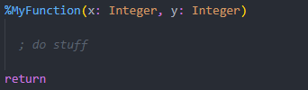
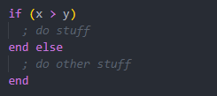
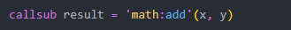

# NC64/ACNC32 Syntax Highlighting

Adds syntax hightlighting for the NC64/ACNC32 language.

## Syntax Highlighting

Full support for syntax highlighting using the <a href="https://github.com/MichaelDelfino/nclang">NCLang TextMate Bundle.</a>

## Examples

### Functions

### Variables / Datatypes

### Logic

### Callsubs / CNCLibraryMethods

 

### Machine Codes

## Semantics / Code Completion

Available in future versions

## Release Notes

Initial release

### 1.0.0

Initial release

---
